# 🚀 Projet HR Analytics – Analyse des causes d’attrition chez TechNova Partners


---

## 📋 Sommaire

1. [Objectif](#🎯-objectif)
2. [Contenu du dépôt](#📂-contenu-du-dépôt)
3. [Installation & Exécution](#⚙️-installation--exécution)
4. [Analyses réalisées](#💡-analyses-réalisées)
5. [Visualisation pour la soutenance](#🖼️-visualisation-pour-la-soutenance)
6. [Technologies & packages](#⚙️-technologies--packages)
7. [Auteurs](#✍️-auteurs)

---

## 🎯 Objectif

L’entreprise **TechNova Partners** fait face à un taux de démission élevé.  
La mission consiste à :

1. **Analyser et préparer les données RH** issues de trois sources : SIRH, évaluations, sondages.
2. **Explorer les variables explicatives de l’attrition** (salaires, postes, satisfaction, heures supplémentaires, etc.).
3. **Construire et comparer des modèles prédictifs** pour identifier les employés à risque de départ.
4. **Interpréter les modèles** via feature importance globale et locale (SHAP).
5. **Fournir un support décisionnel au CODIR** via une présentation claire et synthétique.

---

## 📂 Contenu du dépôt

- `pyproject.toml` → Gestion des dépendances et compatibilités Python (≥3.10, <3.13).
- `scripts/` → Scripts Python et notebook pour toute la pipeline ML :
  - `Huang_Nicolas_2_notebook.ipynb`
  - `Huang_Nicolas_2_notebook.py`
- `data/` → Jeux de données CSV fournis (`extrait_sirh.csv`, `extrait_eval.csv`, `extrait_sondage.csv`).
- `presentation/` → Support PowerPoint pour le CODIR :
  - `P10_Machine_Learning_Huang_Nicolas_112025.pptx`
- `public/images/` → Screenshots de la présentation (`slide1.png` → `slide23.png`).
- `requirements.txt` → Liste des packages Python nécessaires.
- `README.md`

---

## ⚙️ Installation & Exécution

### 1. Cloner le dépôt

```bash
git clone https://github.com/hNnicolas/P10_classification_auto_machine_learning.git
cd P10_classification_auto_machine_learning
```

### 2. Créer un environnement virtuel (recommandé)

```bash
python -m venv venv
source venv/bin/activate    # macOS/Linux
venv\Scripts\activate       # Windows
```

### 3. Installer les dépendances

```bash
pip install -r requirements.txt
```

### 4. Exécuter le script Python

```bash
python scripts/Huang_Nicolas_2_notebook.py
```

## 💡 Analyses réalisées

Préparation et nettoyage des données

Fusion de trois jeux de données (SIRH, évaluations, sondages)

Suppression des doublons et harmonisation des identifiants employés

Gestion des valeurs manquantes et des formats de variables

Analyse exploratoire

Étude de la répartition des départs (16 % d’attrition)

Analyse de corrélation des variables numériques

Visualisation des distributions clés (ancienneté, satisfaction, performance)

Préparation pour le machine learning

Encodage des variables catégorielles (OneHotEncoder)

Regroupement des catégories rares

Standardisation des variables numériques

Séparation en X (features) et y (cible)

Modélisation

Modèles testés : Dummy, Logistic Regression, Random Forest

Gestion du déséquilibre de classes (class_weight='balanced')

Optimisation des hyperparamètres (GridSearchCV)

Évaluation via Accuracy, Precision, Recall, F1-score

Interprétation

Feature importance native du RandomForest

Importance par permutation

## 📈 Résultats & Insights clés

Meilleur modèle : LogisticRegression

Métrique Valeur
Accuracy 0.762
Précision 0.371
Rappel 0.702
F1-score 0.485

🧠 Interprétation :

Le modèle met l’accent sur le rappel, ce qui signifie qu’il identifie bien les employés à risque de départ, quitte à produire quelques faux positifs.

Cette approche est pertinente dans un contexte RH où mieux vaut prévenir un départ que manquer un signal d’alerte.

Les variables les plus importantes identifiées concernent :

La satisfaction au travail

L’ancienneté dans l’entreprise

Les notes d’évaluation

Le département / manager

## 🖼️ Visualisation de la présentation

Les slides de la présentation sont inclus dans le dossier `public/images/` :


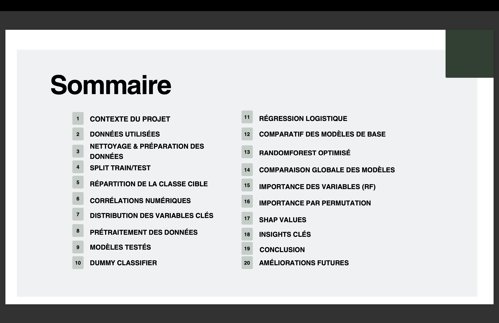

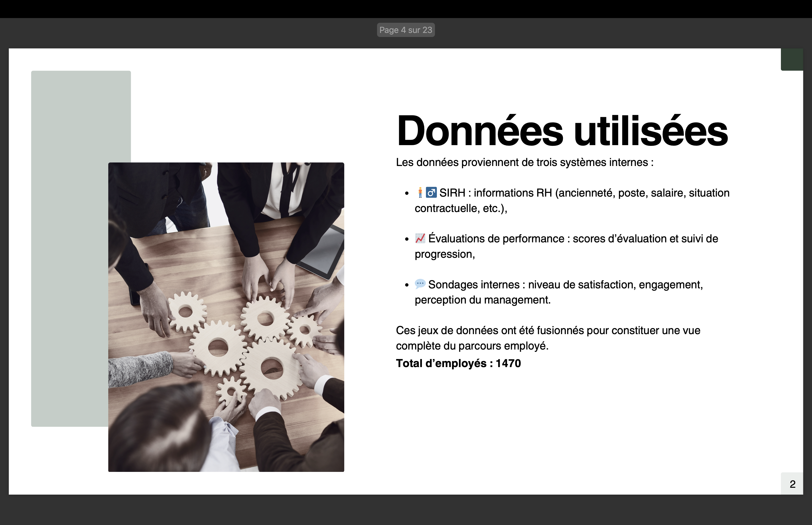

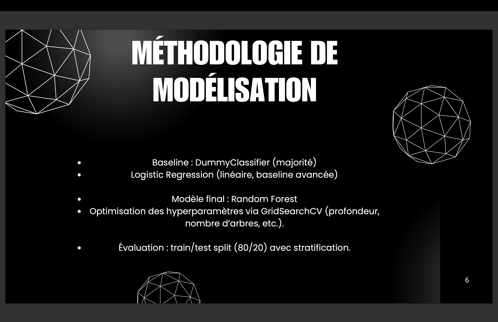
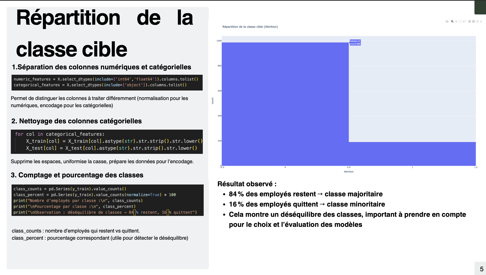
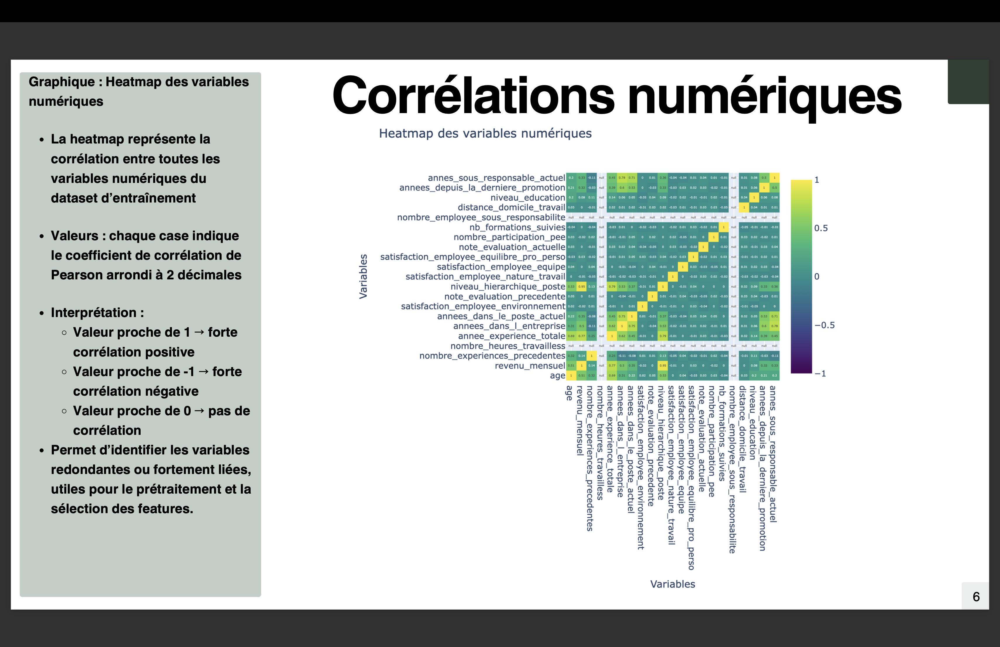
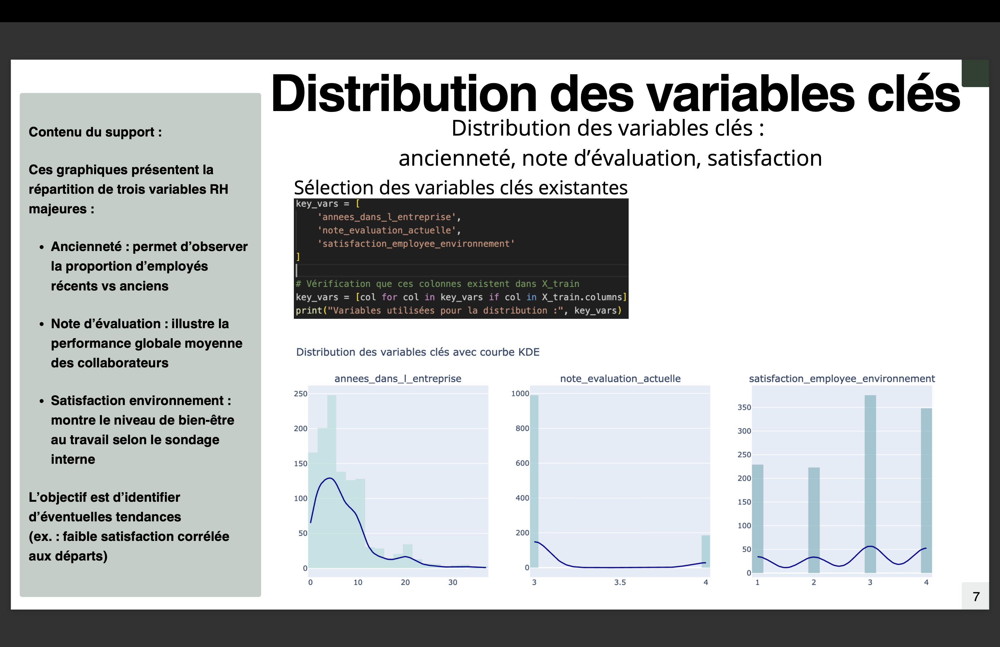
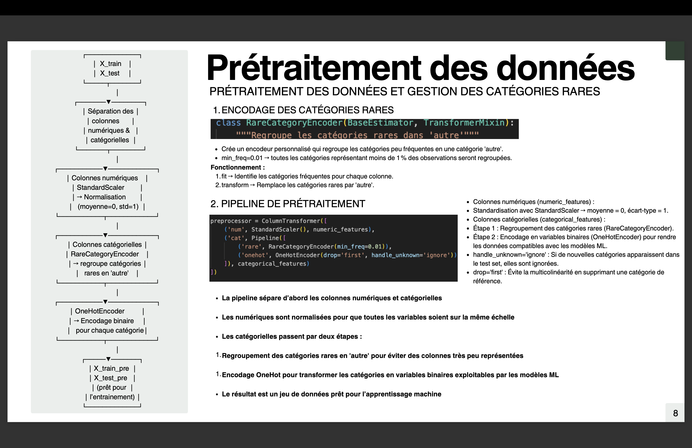


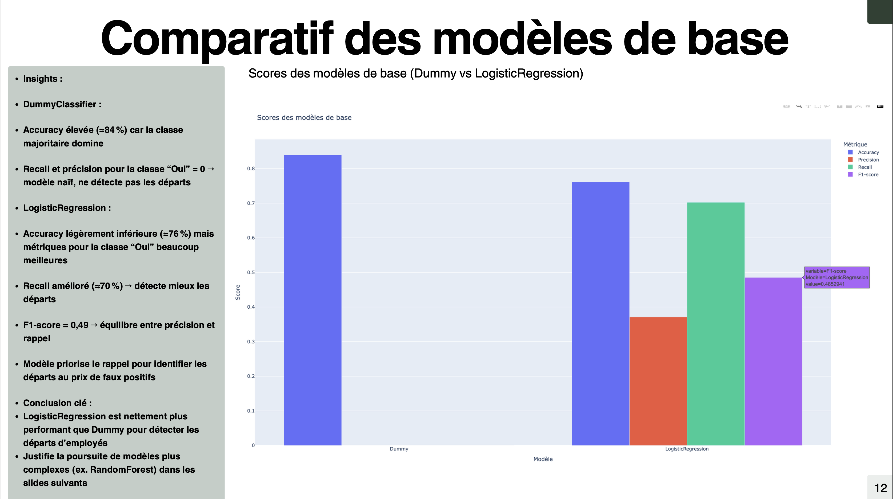
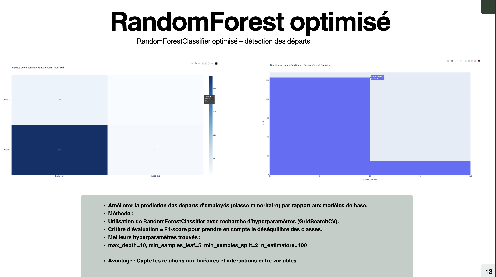
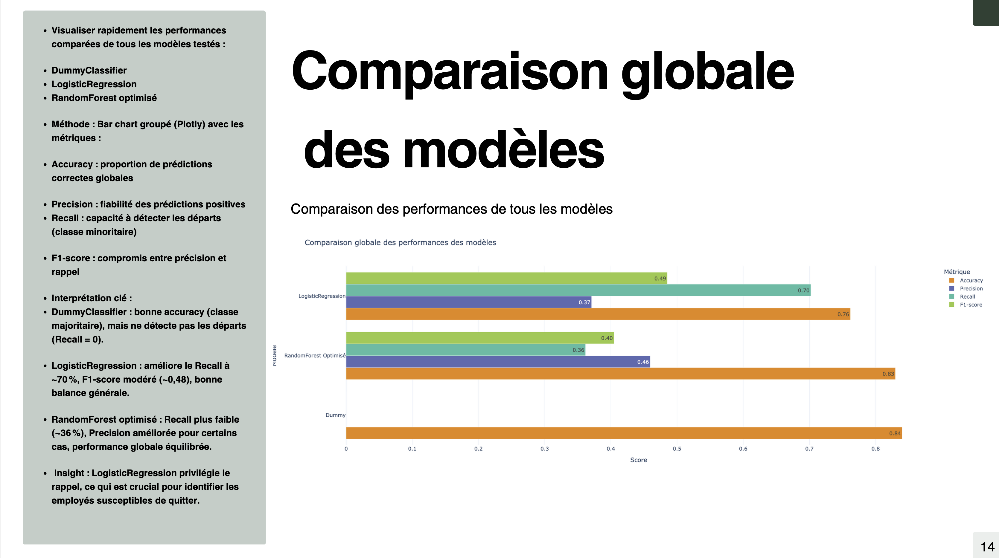
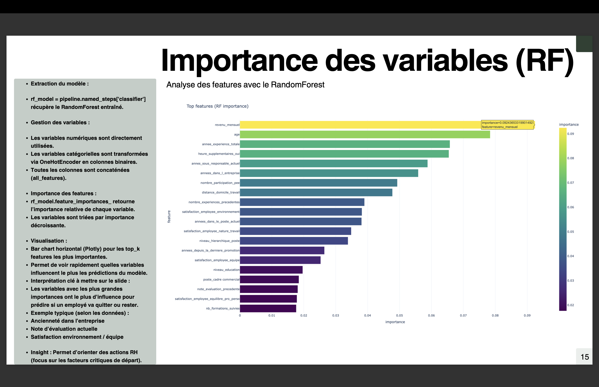
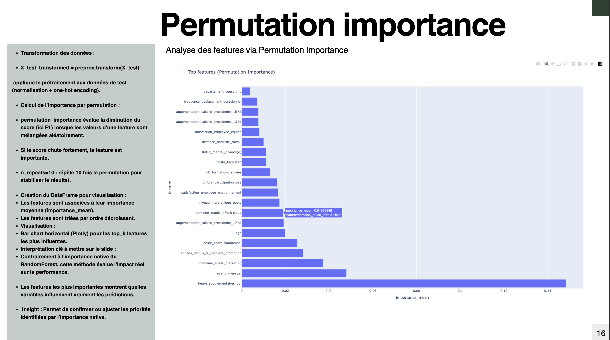
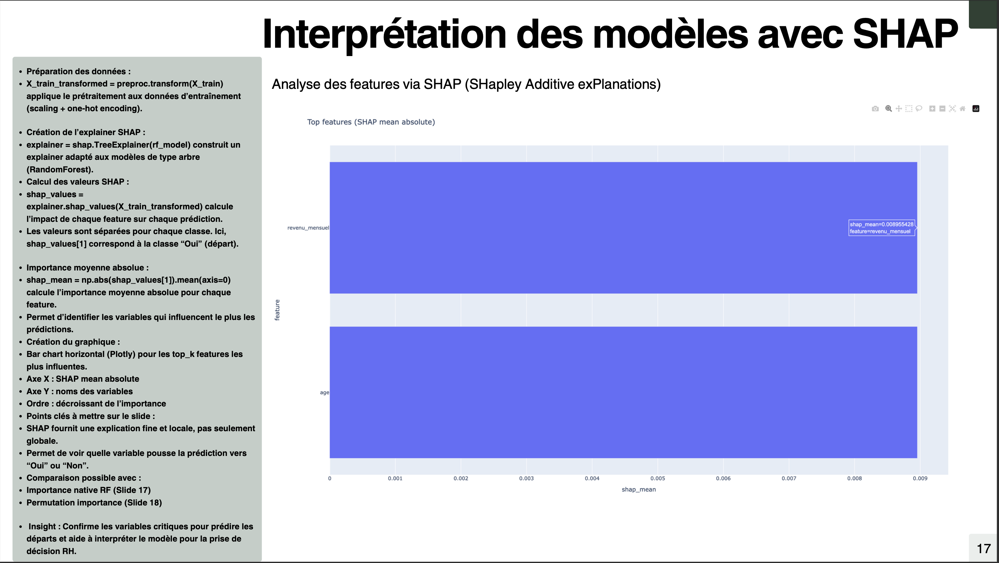
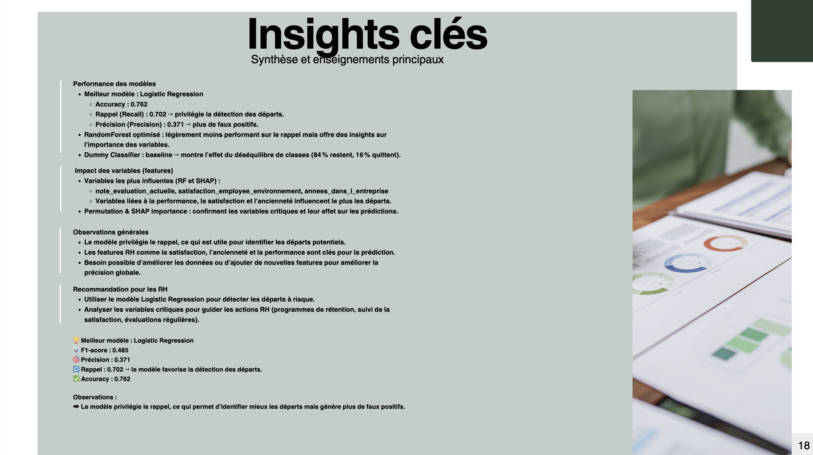
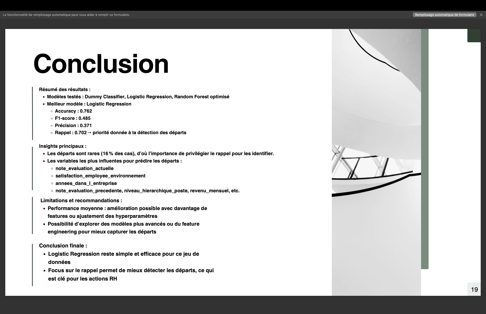
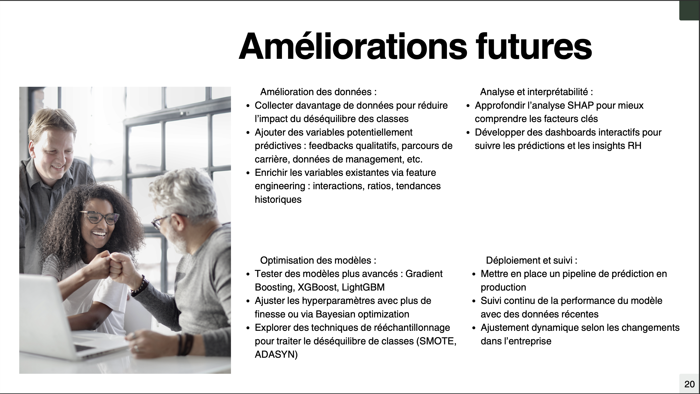


Graphiques inclus dans le script Python (`scripts/Huang_Nicolas_2_notebook.py`) pour illustrer :

- Comparaison des modèles
- Distribution des employés
- Importance des features
- Visualisations SHAP (Beeswarm et Waterfall)

## ⚙️ Technologies & packages

Python ≥ 3.10

Packages principaux :

pandas, numpy, matplotlib, seaborn, plotly

scikit-learn (modélisation et preprocessing)

shap (interprétabilité)

Environnement : Terminal / IDE (VS Code, PyCharm, etc.)

## ✍️ Auteurs

Nicolas Huang
