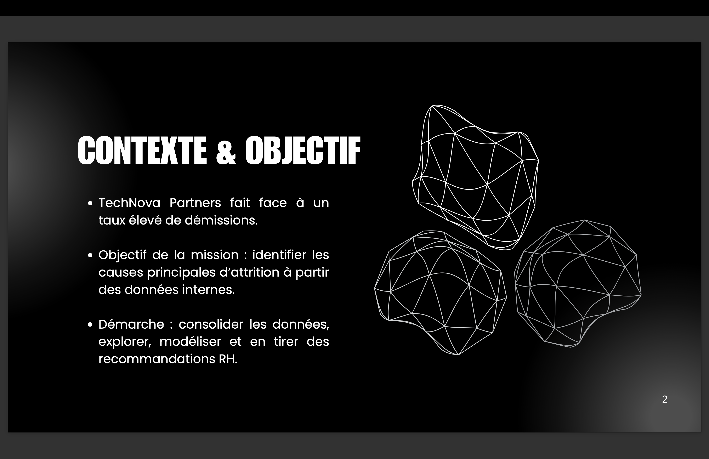
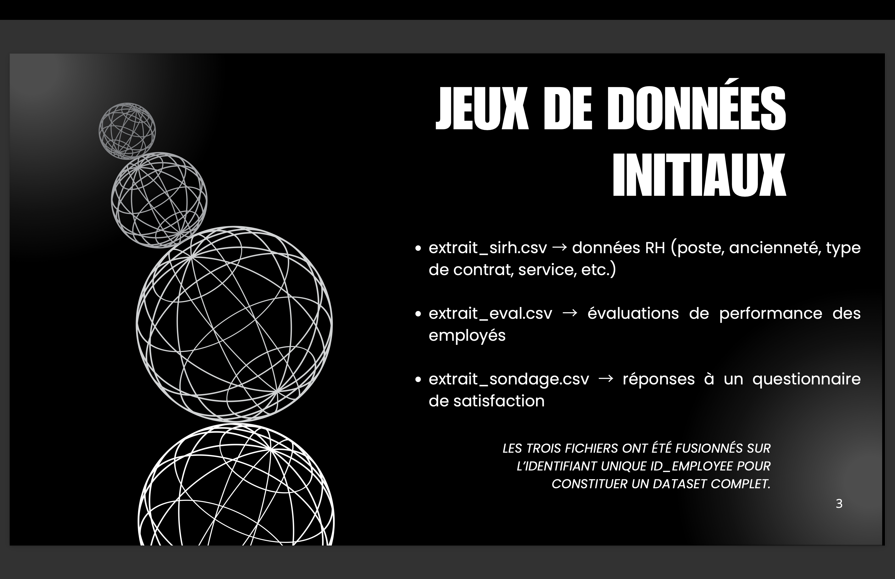
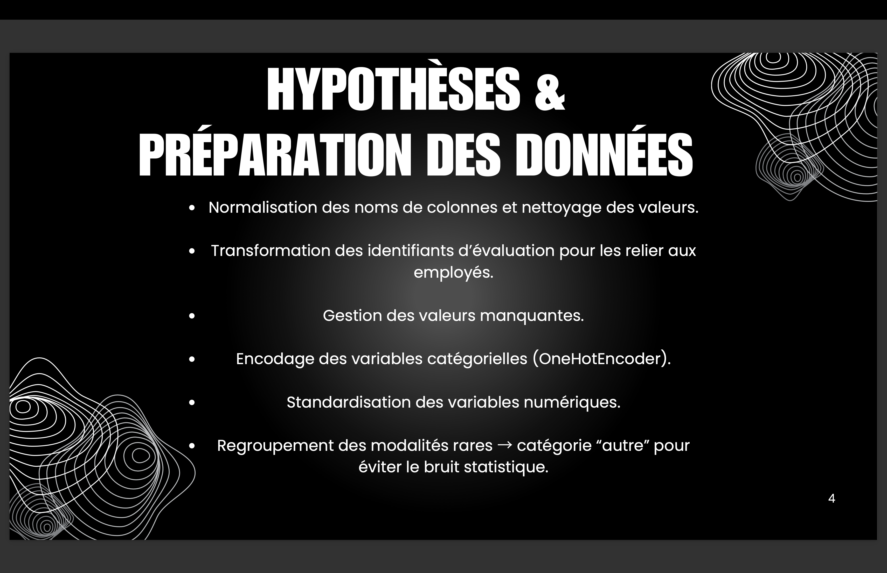
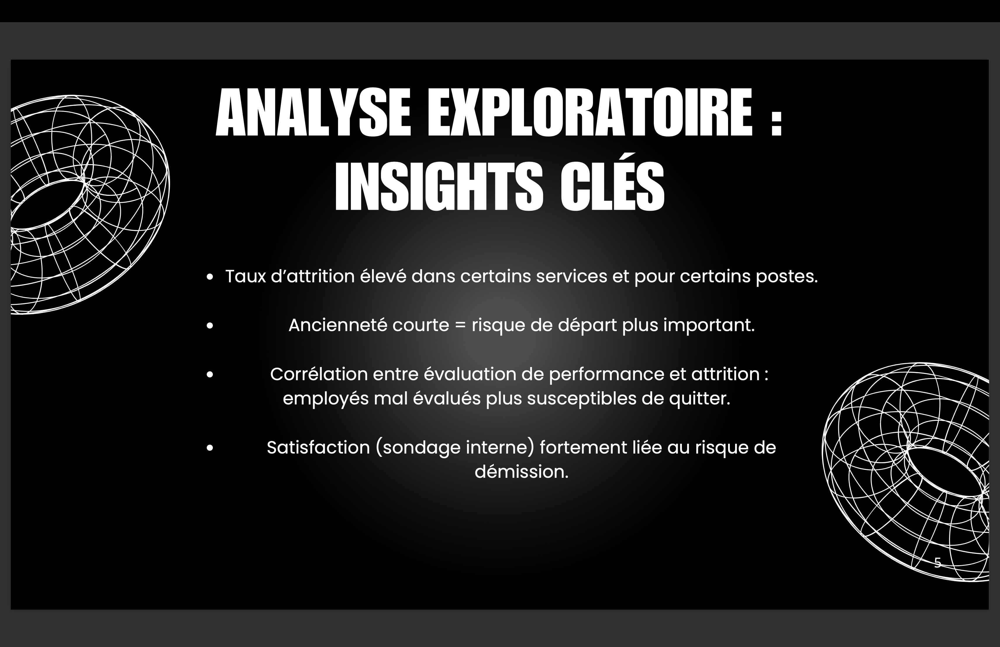
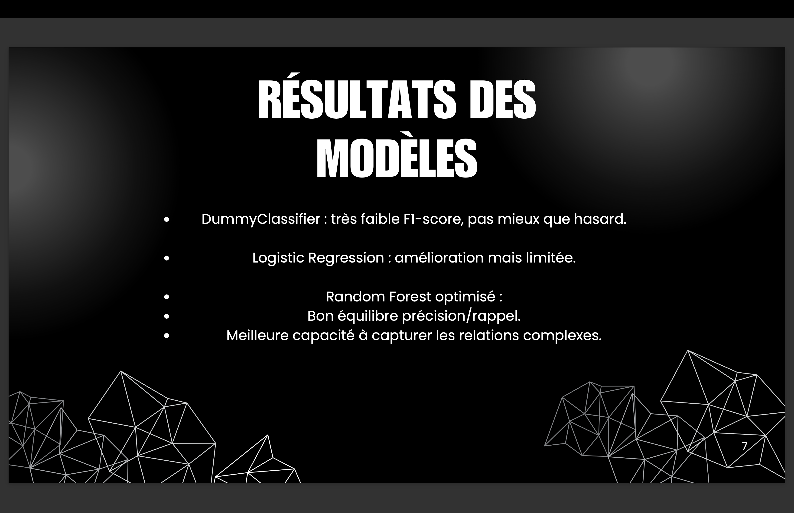
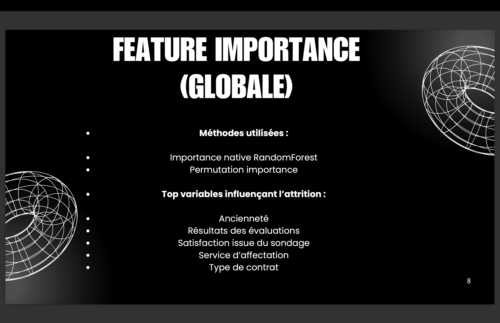
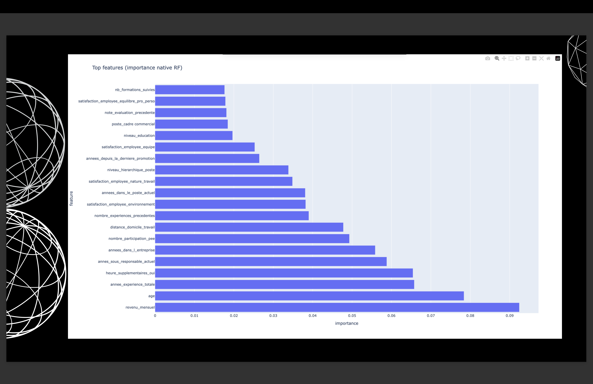
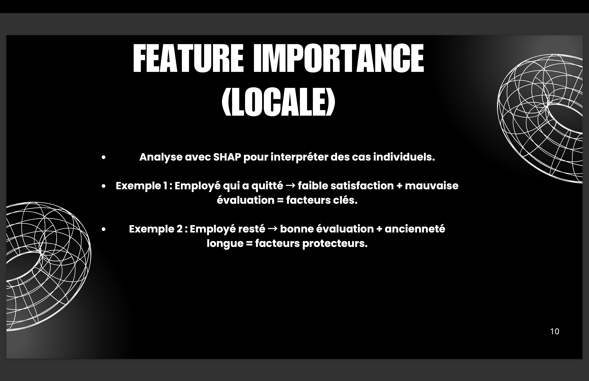
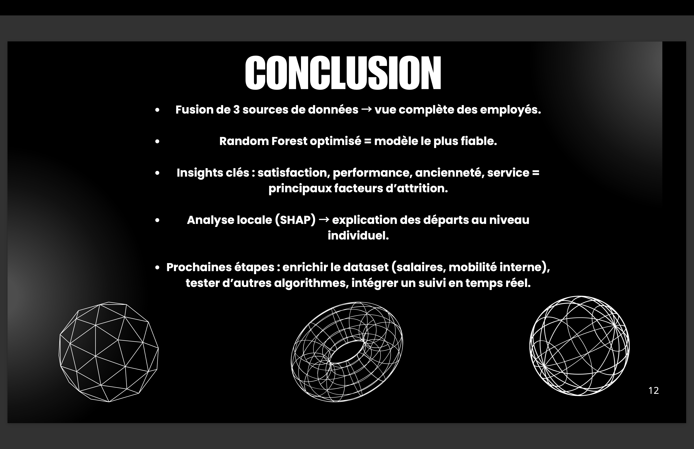

# 🚀 Projet HR Analytics – Analyse des causes d’attrition chez TechNova Partners


---

## 📋 Sommaire

1. [Objectif](#🎯-objectif)
2. [Contenu du dépôt](#📂-contenu-du-dépôt)
3. [Installation & Exécution](#⚙️-installation--exécution)
4. [Analyses réalisées](#💡-analyses-réalisées)
5. [Visualisation pour la soutenance](#🖼️-visualisation-pour-la-soutenance)
6. [Technologies & packages](#⚙️-technologies--packages)
7. [Auteurs](#✍️-auteurs)

---

## 🎯 Objectif

L’entreprise **TechNova Partners** fait face à un taux de démission élevé.  
La mission consiste à :

1. **Analyser et préparer les données RH** issues de trois sources : SIRH, évaluations, sondages.
2. **Explorer les variables explicatives de l’attrition** (salaires, postes, satisfaction, heures supplémentaires, etc.).
3. **Construire et comparer des modèles prédictifs** pour identifier les employés à risque de départ.
4. **Interpréter les modèles** via feature importance globale et locale (SHAP).
5. **Fournir un support décisionnel au CODIR** via une présentation claire et synthétique.

---

## 📂 Contenu du dépôt

- `pyproject.toml` → Gestion des dépendances et compatibilités Python (≥3.10, <3.13).
- `scripts/` → Scripts Python et notebook pour toute la pipeline ML :
  - `Huang_Nicolas_2_notebook.ipynb`
  - `Huang_Nicolas_2_notebook.py`
- `data/` → Jeux de données CSV fournis (`extrait_sirh.csv`, `extrait_eval.csv`, `extrait_sondage.csv`).
- `presentation/` → Support PowerPoint pour le CODIR :
  - `P10_Machine_Learning_Huang_Nicolas_112025.pptx`
- `public/images/` → Screenshots de la présentation (`slide1.png` → `slide13.png`).
- `requirements.txt` → Liste des packages Python nécessaires.
- `README.md`

---

## ⚙️ Installation & Exécution

### 1. Cloner le dépôt

```bash
git clone https://github.com/hNnicolas/P10_classification_auto_machine_learning.git
cd P10_classification_auto_machine_learning
```
### 2. Créer un environnement virtuel (recommandé)

```bash
python -m venv venv
source venv/bin/activate    # macOS/Linux
venv\Scripts\activate       # Windows
```

### 3. Installer les dépendances

```bash
pip install -r requirements.txt
```

### 4. Exécuter le script Python

```bash
python scripts/Huang_Nicolas_2_notebook.py
```

## 💡 Analyses réalisées

Nettoyage et fusion des données issues de trois sources.

Analyse descriptive des employés selon départ/non-départ.

Transformation des variables pour les modèles ML (encodage, scaling, regroupement des catégories rares).

Entraînement de modèles : Dummy, Logistic Regression, RandomForest.

Évaluation des modèles via métriques F1, précision, rappel.

Optimisation des hyperparamètres pour RandomForest avec GridSearchCV.

Feature importance :

Importance native RandomForest

Permutation importance

Analyse SHAP (global et local)

Identification des facteurs clés pouvant influencer la démission.

## 🖼️ Visualisation de la présentation

Les slides de la présentation sont inclus dans le dossier `public/images/` :  















Graphiques inclus dans le script Python (`scripts/Huang_Nicolas_2_notebook.py`) pour illustrer :  

- Comparaison des modèles
- Distribution des employés
- Importance des features
- Visualisations SHAP (Beeswarm et Waterfall)

## ⚙️ Technologies & packages

Python ≥ 3.10

Packages principaux :

pandas, numpy, matplotlib, seaborn, plotly

scikit-learn (modélisation et preprocessing)

shap (interprétabilité)

Environnement : Terminal / IDE (VS Code, PyCharm, etc.)

## ✍️ Auteurs

Nicolas Huang 

